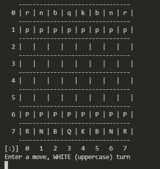
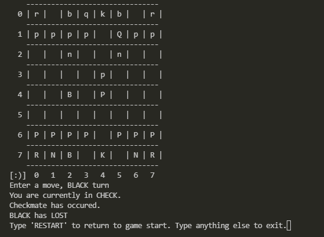

# ♟ Chess
#### Simple command line chess game built to practice object oriented programming (OOP).

#### Two player game of chess. checking, check-mating, stalemating fully implemented. En passent not included yet, and pawns can only promote to queens at the moment. 

## 🎲 How to run

```sh
$ git clone https://github.com/addison-ch/chess-game/
$ cd chess-game/src
$ javac Game.java
$ java Game
```

## 📺 Pictures






